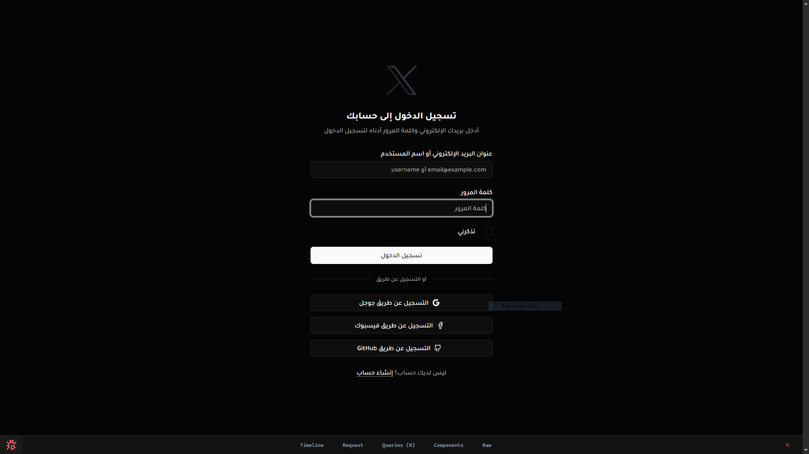
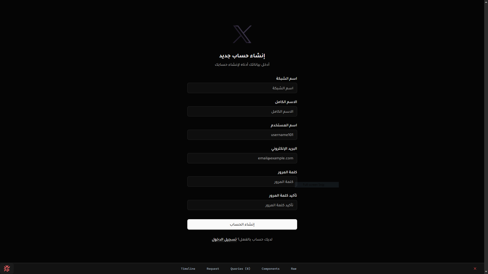
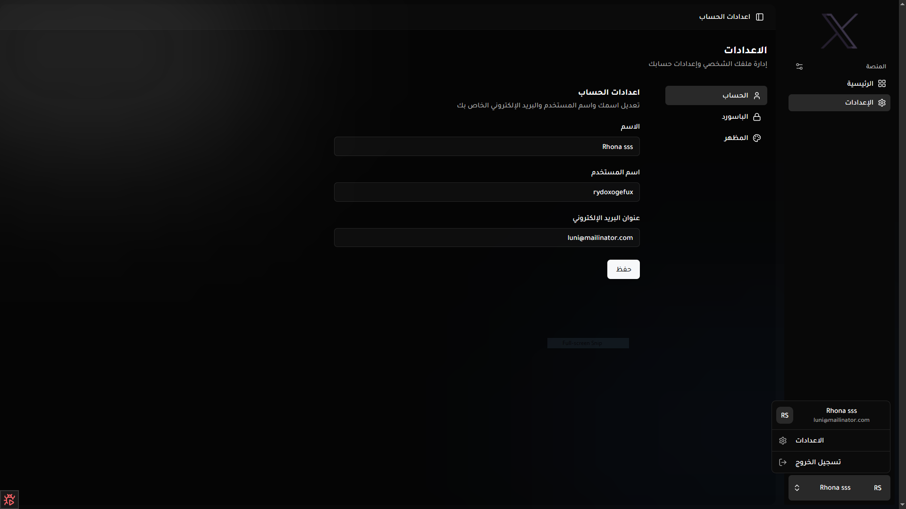
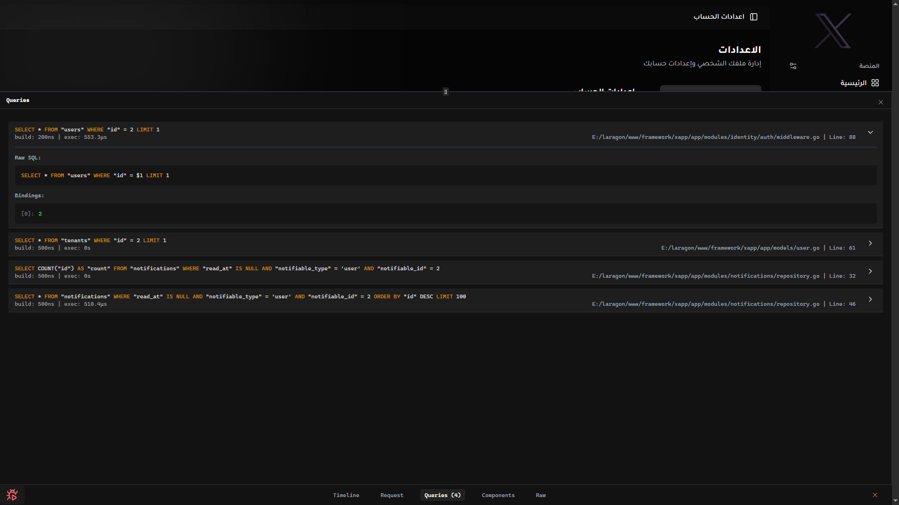

<div align="center">


# XApp — Go SaaS Starter Kit

**A batteries-included Go starter kit for building production-grade SaaS applications.**  
Go backend · Inertia.js · Vue 3 · TypeScript · PostgreSQL · Redis

[](https://go.dev)
[](LICENSE)
[](https://inertiajs.com)
[](https://vuejs.org)

</div>

---

## What is XApp?

**XApp** is an opinionated Go SaaS starter kit that eliminates the boilerplate of setting up a new application from scratch. It wires together a high-performance Go HTTP server with a modern Vue 3 + Inertia.js frontend so you can focus entirely on building your product.

Think of it as the Go equivalent of a full-stack framework — not a library you import, but a **project template with conventions, pre-wired infrastructure, and developer tooling** (the `xcli` CLI) built in from day one.

### Why XApp?

| Pain Point | XApp Solution |
|---|---|
| Go backends require extensive boilerplate | Pre-wired DI, routing, middleware, auth, queues |
| Frontend/backend integration is tedious | Inertia.js makes SPA rendering seamless, no REST layer needed for pages |
| Auth is always rebuilt from scratch | JWT + session auth, OAuth (Google, GitHub, Facebook) ready to go |
| Background jobs require complex setup | Redis-backed Asynq queue with a clean handler registry |
| Every project reinvents file/storage handling | `xdisk` storage abstraction with local and remote backends |

---

## Screenshots

<table>
  <tr>
    <td align="center">
      
      <br/><sub><b>Authentication — Login with OAuth support</b></sub>
    </td>
    <td align="center">
      
      <br/><sub><b>Authentication — Register flow</b></sub>
    </td>
  </tr>
  <tr>
    <td align="center">
      
      <br/><sub><b>Account Settings — Profile management</b></sub>
    </td>
    <td align="center">
      
      <br/><sub><b>Developer Toolbar — Live query inspector</b></sub>
    </td>
  </tr>
</table>

---

## Project Structure

XApp follows a **Bounded Context + Shared Domain Architecture**. The `app/` directory is split into two clear concerns: a **shared domain** (cross-cutting building blocks used everywhere) and **bounded contexts** (self-contained feature areas, each composed of multiple sub-modules).

```text
xapp/
├── app/                             # Application core
│   │
│   ├── domain/                      # ★ Shared Domain (shared kernel)
│   │   ├── events/                  #   Domain event definitions (EventUserLoggedIn, etc.)
│   │   ├── enums/                   #   Shared enum types across all bounded contexts
│   │   ├── rules/                   #   Custom validation rules (unique_db, exists_db, ...)
│   │   ├── hooks/                   #   Lifecycle hooks (before/after model operations)
│   │   ├── tasks/                   #   Background task type definitions
│   │   ├── notifications/           #   Shared notification payload definitions
│   │   ├── adapters/                #   Interface adapters shared across contexts
│   │   └── utils/                   #   Pure utility helpers
│   │
│   ├── modules/                     # ★ Bounded Contexts
│   │   │
│   │   ├── identity/                #   Identity context (auth, users, tenants)
│   │   │   ├── auth/                #     Auth sub-module: JWT, middleware, OAuth, permissions
│   │   │   ├── users/               #     Users sub-module: model, repo, actions, handlers
│   │   │   ├── tenants/             #     Tenants sub-module: multi-tenancy support
│   │   │   └── routes.go            #     Route registration for the entire identity context
│   │   │
│   │   ├── billing/                 #   Billing context (plans, subscriptions, invoices)
│   │   │   ├── plans/               #     Plans sub-module
│   │   │   ├── subscriptions/       #     Subscriptions sub-module
│   │   │   ├── invoices/            #     Invoices sub-module
│   │   │   ├── orders/              #     Orders sub-module
│   │   │   └── transactions/        #     Transactions sub-module
│   │   │
│   │   ├── settings/                #   Settings context: app & user settings
│   │   ├── notifications/           #   Notifications context: DB, websocket, whatsapp dispatch
│   │   └── audit_logs/              #   Audit Logs context: activity trail listeners & repo
│   │
│   ├── http/                        # Global HTTP layer (router, middleware, routes wiring)
│   ├── models/                      # Shared xqb model base types
│   ├── providers/                   # Service provider bindings (xioc DI wiring)
│   ├── registers/                   # CLI command & validation rule registries
│   ├── registers.go                 # Central wiring: bus, tasks, notify, websocket
│   └── logic.go                     # App helpers (App(), AppMust(), etc.)
│
├── bootstrap/                       # Boot sequence — builder, runner, adapters
├── cmd/
│   ├── server/                      # `go run ./cmd/server` — HTTP server entrypoint
│   └── xcli/                        # `go run ./cmd/xcli`  — CLI entrypoint (proxy)
│
├── config/                          # Config structs loaded from .env via xfig
├── pkg/                             # Internal reusable packages
│   ├── bus/                         #   Event bus (in-process + Asynq-backed async)
│   ├── inertia/                     #   Inertia.js adapter and shared props
│   ├── logger/                      #   Zap-based structured logger
│   └── tls/                         #   TLS/HTTPS helpers
│
├── resources/                       # Frontend source
│   ├── js/                          #   Vue 3 + TypeScript components & pages
│   └── css/                         #   Tailwind CSS entry point
│
├── public/                          # Statically served assets
├── storage/                         # Local disk storage (logs, uploads, etc.)
└── .env / .env.example              # Environment configuration
```

### Shared Domain vs. Bounded Contexts

| Layer | Path | Purpose |
|---|---|---|
| **Shared Domain** | `app/domain/` | Cross-cutting building blocks — event definitions, enums, validation rules, hooks, and utility helpers. All bounded contexts may import from here, but the shared domain never imports from a module. |
| **Bounded Context** | `app/modules/<context>/` | A self-contained feature area encapsulating all its own business logic. Each context owns its sub-modules and exposes a single `routes.go` to the HTTP layer. |
| **Sub-module** | `app/modules/<context>/<module>/` | A focused unit inside a bounded context (e.g. `auth` inside `identity`). Contains handlers, actions, models, repositories, and requests. |

### Sub-module Anatomy

Every sub-module inside a bounded context follows the same internal layout:

```text
app/modules/<context>/<module>/
├── actions/       # Single-responsibility business transactions (CreateUser, RenewSubscription...)
├── handlers/      # HTTP controllers — parse request, call action, return Inertia/JSON response
├── models/        # xqb database schemas owned by this sub-module
├── repositories/  # Database querying & persistence layer
├── requests/      # Input validation schemas (xvalid)
└── listeners/     # Domain event listeners reacting to shared domain events
```

---

## Core Packages

XApp bundles a suite of purpose-built Go packages under the `github.com/imohamedsheta` namespace:

| Package | Role |
|---|---|
| **`xioc`** | Dependency injection container — singletons, factories, parameter bindings |
| **`xfig`** | Config loader — reads `.env` files and maps values to typed config structs |
| **`xdisk`** | Storage abstraction — local disk, public symlinks, remote backup support |
| **`xvalid`** | HTTP request validation — strongly typed schemas with custom rule support |
| **`xws`** | WebSocket hub — channel policies, broadcast, per-user subscriptions |
| **`xnotify`** | Multi-channel notification dispatcher — database, websocket, WhatsApp |
| **`xsocial`** | OAuth 2.0 provider integration — Google, GitHub, Facebook |
| **`xerr`** | Structured error types with HTTP status awareness |
| **`xqb`** | Query builder — fluent SQL construction on top of `pgx` |
| **`xcli`** | CLI scaffolding tool — generators, migrations, dev server |

---

## Backend Features

### 🔐 Authentication & Authorization
- JWT-based stateless auth with refresh tokens
- Session-based auth via secure cookies
- OAuth 2.0 login (Google, GitHub, Facebook) via `xsocial`
- Role-based permission system with `PermissionService` and `AuthMiddleware`
- CSRF protection via gorilla/csrf

### ⚙️ Dependency Injection (`xioc`)
All services are registered and resolved through an IoC container, preventing global state and enabling easy testing. Services are wired in `app/providers/` and validated at compile time via `iocMustAllRegistered`.

### 📨 Background Jobs & Event Bus
- **Asynq** (Redis-backed) task queue for durable, reliable job processing
- **Event bus** with in-process synchronous listeners and async Asynq dispatch
- Notification tasks dispatched through the same queue (`xnotify.TaskType`)

### 🔔 Notifications
Three built-in notification channels:
- `database` — stores notifications in the database
- `websocket` — real-time push via `xws` hub
- `whatsapp` — WhatsApp message dispatch

### 🌐 WebSockets
Channel-based WebSocket server with access control policies. Example:
```go
var websocketChannels = []*xws.ChannelPolicy{
    {
        Pattern: "user_notifications.*",
        CanRead: func(userID, channel string) bool {
            return channel == "user_notifications."+userID
        },
        CanWrite: func(userID, channel string) bool {
            return false // server-only broadcast
        },
    },
}
```

### 🗃️ Database
- PostgreSQL via `pgx/v5`
- `xqb` query builder with fluent chaining
- **Goose** migrations scoped per domain module
- Live **query inspector** in the developer toolbar (see screenshot above)

### 📝 Custom Validation Rules
Register project-specific rules globally:
```go
func ValidationRules() map[string]validator.FuncCtx {
    return map[string]validator.FuncCtx{
        "unique_db":      rules.UniqueInDB,
        "exists_db":      rules.ExistsInDB,
        "egyptian_phone": rules.EgyptianPhone,
    }
}
```

---

## Frontend Features

| Feature | Details |
|---|---|
| **Inertia.js v2 + Vue 3** | Server-driven routing, SPA rendering — no REST API layer needed for page data |
| **TypeScript** | Full type safety end-to-end |
| **Tailwind CSS + shadcn/ui** | Pre-configured design system with dark mode |
| **Vite** | Lightning-fast HMR dev server and optimized production builds |
| **PWA** | Service worker support via `vite-plugin-pwa` |
| **Localization** | Front-end i18n loader with static definition files |

---

## Getting Started

### Prerequisites

- **Go** 1.22+
- **Node.js** 20+
- **PostgreSQL** 15+
- **Redis** 7+

### 1. Clone the Repository

```bash
git clone https://github.com/imohamedsheta/xapp.git my-app
cd my-app
```

### 2. Configure Environment

```bash
cp .env.example .env
```

Edit `.env` with your database and Redis credentials:

```dotenv
DB_HOST=127.0.0.1
DB_PORT=5432
DB_NAME=xapp
DB_USER=postgres
DB_PASSWORD=secret

REDIS_ADDR=127.0.0.1:6379

APP_URL=http://localhost:8080
APP_KEY=your-32-char-secret-key-here
```

### 3. Install Frontend Dependencies

```bash
npm install
```

### 4. Install & Run the CLI

```bash
# Install the xcli tool globally
go install github.com/imohamedsheta/xcli/cmd/xcli@latest

# Start Go backend + Vite frontend simultaneously
xcli dev
```

That's it — the app will be available at `http://localhost:8080`.

---

## Command Line Interface (`xcli`)

`xcli` is the companion CLI tool for XApp. It provides code generators, migration utilities, and a dev server launcher.

### Code Generators

```bash
# Generate a domain module scaffold (handler, model, repository, request, routes)
xcli make:module Invoice

# Generate individual layers
xcli make:model Invoice
xcli make:handler Invoice -a -r -R   # with actions (-a), repository (-r), request (-R)
xcli make:crud Invoice               # full CRUD: backend + Vue index page
```

### Database Migrations

```bash
# Create a migration scoped to a domain module
xcli migrate:make create_invoices_table --domain billing

# Run all pending migrations
xcli migrate

# Rollback the last batch
xcli migrate:rollback
```

### Stub Customization

Publish embedded stubs to your project for customization:

```bash
xcli stub:publish
```

Stubs in your local `stubs/` directory take priority over the embedded defaults, allowing you to tailor generated code to your conventions.

---

## Architecture: How It All Fits Together

```
HTTP Request
    │
    ▼
Gin Router (app/http/routes.go)
    │
    ▼
Global Middleware (CORS, CSRF, Rate Limit, Auth)
    │
    ▼
Module Handler (app/modules/<domain>/handlers/)
    │
    ├── Validates input via xvalid Request schema
    ├── Calls Action (single-responsibility business logic)
    │       └── Uses Repository for DB access (xqb)
    ├── Dispatches Events → Event Bus → Listeners (sync or async via Asynq)
    │       └── Listeners can send Notifications via xnotify
    └── Returns Inertia response (page render) or JSON
```

---

## Configuration

All configuration is loaded from `.env` via **`xfig`** and mapped to typed structs in `config/`:

| Config File | Purpose |
|---|---|
| `config/app.go` | App name, URL, environment, secret key |
| `config/database.go` | PostgreSQL DSN and pool settings |
| `config/redis.go` | Redis address and auth |
| `config/auth.go` | JWT secret, token TTL, OAuth credentials |
| `config/storage.go` | Disk names and base paths |

---

## Running in Production

```bash
# Build the server binary
go build -o xapp-server ./cmd/server

# Build frontend assets
npm run build

# Run the server
./xapp-server
```

For process management, use **systemd** or a supervisor like `s6` or `supervisord`. Redis and a PostgreSQL instance must be running and accessible via the environment variables in `.env`.

---

## Contributing

1. Fork the repository
2. Create your feature branch: `git checkout -b feature/my-feature`
3. Commit your changes: `git commit -m 'feat: add my feature'`
4. Push to the branch: `git push origin feature/my-feature`
5. Open a Pull Request

---

## License

Distributed under the **MIT License**. See [LICENSE](LICENSE) for more information.
